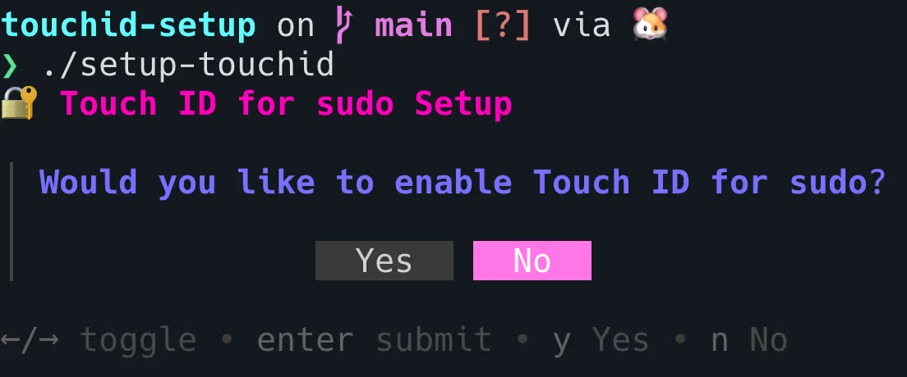
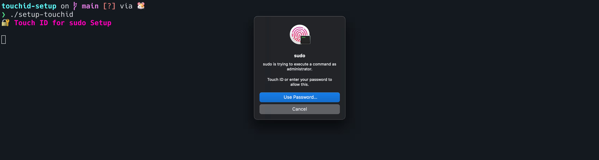

# Homepage for MacOS Utility TouchyMcRootFace

An absolute BANGER of an awesome cool slick eye-catching homepage for my new MacOS utility that enables touchid when terminal requests sudoers access

## App Images

- 
- 

## Site Design/Aesthetic

A modern, eye-catching landing page that:

1. Uses a dark theme to match the terminal aesthetic
2. Features a gradient text hero section that grabs attention
3. Shows the simple installation command in a copyable terminal-like interface
4. Includes the Touch ID prompt screenshot with a beautiful gradient glow effect
5. Has a clear three-step installation guide
6. Uses colors from your terminal screenshot (cyan, fuchsia, purple) for visual consistency
7. Is fully responsive and works on all screen sizes

The design emphasizes simplicity and security while maintaining a modern, developer-friendly aesthetic.